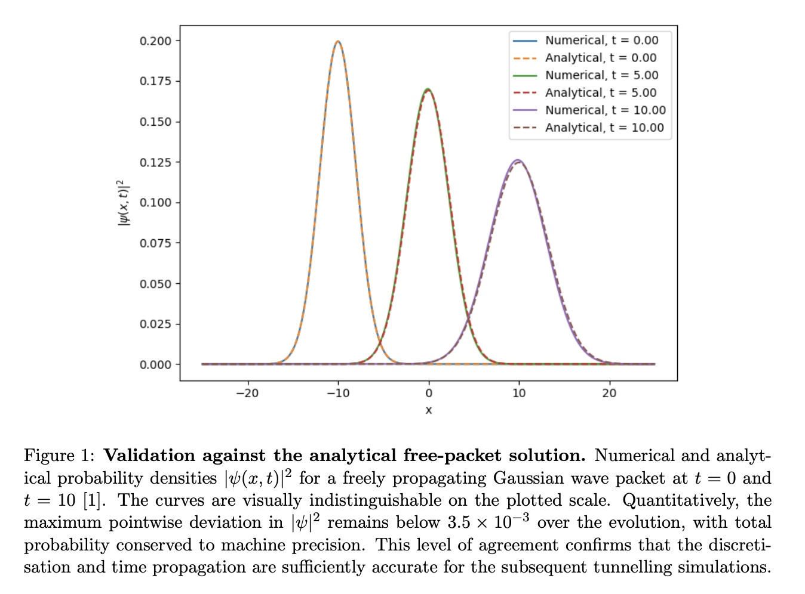
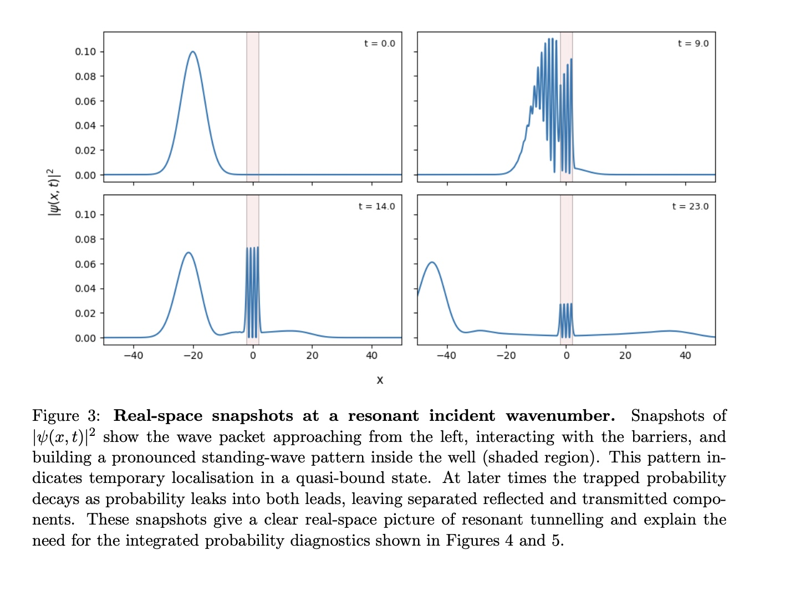
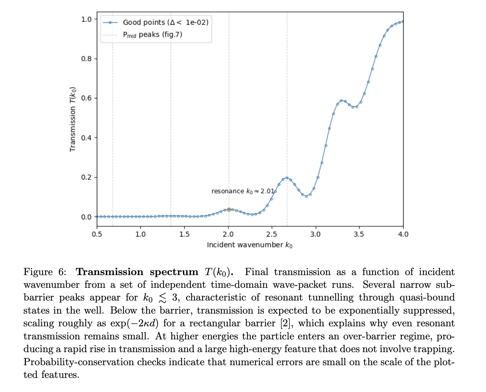

### A Time-Dependent Wave-Packet Simulation | Python · NumPy · SciPy

---

## Overview

This project simulates the quantum mechanical behaviour of a particle hitting a potential barrier, using a time-dependent wave-packet approach to solve the Schrödinger equation numerically. The core physics is quantum tunnelling — the phenomenon where a particle can pass through a barrier even when its energy is lower than the barrier height, something that has no classical equivalent.

The simulation goes beyond a single barrier to investigate **resonant tunnelling** through a double-barrier system, where a quantum well between two barriers traps the particle in a quasi-bound state at specific resonant energies. This produces sharp peaks in transmission probability — behaviour directly analogous to that exploited in real semiconductor devices such as resonant tunnelling diodes.

---

## The Physics

A Gaussian wave packet is prepared to the left of the barrier system and propagates rightward. Its evolution is governed by the time-dependent Schrödinger equation:

```
iℏ ∂ψ/∂t = -(ℏ²/2m) ∂²ψ/∂x² + V(x)ψ
```

The spatial second derivative is discretised on a uniform grid using finite differences, converting the differential equation into a matrix equation. The double-barrier potential consists of two identical rectangular barriers of height U₀ and width d, enclosing a central well of width L_well:

```
V(x) = U₀  inside each barrier
V(x) = 0   elsewhere
```

At resonant energies, the incident packet couples into quasi-bound states inside the well, producing a standing-wave pattern and delayed leakage — dramatically enhanced transmission compared to off-resonance energies.

---

## Numerical Approach

The Hamiltonian is represented as a sparse tridiagonal matrix using `scipy.sparse`, combining a finite-difference Laplacian with a diagonal potential matrix. Since `scipy.integrate.solve_ivp` requires real-valued inputs, the complex wavefunction ψ is split into real and imaginary parts and concatenated into a single real vector before time integration, then reconstructed afterwards. The `RK45` method is used with tight tolerances (`rtol=1e-7`, `atol=1e-9`).

The energy scan uses an adaptive time window per wavenumber:

```
t_end(k0) = A + B / k0
```

This ensures slower (low k₀) packets have sufficient time to interact with and clear the barrier before the simulation ends, while keeping runtime manageable at higher energies.

---

## Code Structure

| File | Description |
|---|---|
| `qt_utils.py` | Core library: grid construction, sparse Hamiltonian assembly, Gaussian wavepacket initialisation, time evolution via `solve_ivp`, norm and region probability calculations |
| `main_validation.py` | Stage 1 — validates the solver against the analytical free-packet solution; prints error metrics and norm conservation table |
| `main_double_barrier_runs.py` | Stages 2 & 3 — time-domain simulations of resonant and non-resonant scattering; produces real-space snapshots and probability flow plots; fits exponential decay to P_mid(t) |
| `main_energy_scan.py` | Stages 4 & 5 — scans incident wavenumber k₀ to map the full transmission spectrum T(k₀); performs a high-resolution zoomed scan around the strongest resonance and fits a Lorentzian with uncertainty estimates |

---

## Key Results

**Validation** — The numerical solver was benchmarked against the exact analytical solution for a freely propagating Gaussian packet. Maximum pointwise deviation in |ψ|² remained below 3.5 × 10⁻³, with total probability conserved to machine precision.



**Resonant trapping** — At resonant energies, the well probability P_mid(t) rises sharply to ~0.21 before decaying on a timescale consistent with tunnelling-limited escape from a metastable state. Off-resonance, the peak well population is an order of magnitude smaller. Real-space snapshots show the standing-wave pattern building inside the well at resonance.



**Transmission spectrum** — An energy scan over incident wavenumber reveals several narrow sub-barrier transmission peaks, characteristic of quasi-bound states in the well. A high-resolution scan of one peak produces a Lorentzian line shape consistent with the Breit–Wigner form, yielding resonance energy E₀ ≈ 2.05 and width Γ ≈ 0.76 in natural units.



---

## Dependencies

```
python >= 3.9
numpy
scipy
matplotlib
```

Install with:
```bash
pip install numpy scipy matplotlib
```

---

## Running the Code

Run the scripts in order — each stage builds on the previous:

```bash
# Stage 1: Validate the solver against the analytical free-packet solution
python main_validation.py

# Stages 2 & 3: Time-domain resonant and non-resonant simulations
python main_double_barrier_runs.py

# Stages 4 & 5: Full energy scan and Lorentzian resonance fit
python main_energy_scan.py
```

> **Note:** `main_energy_scan.py` runs 80+ independent time evolutions and may take several minutes. The spatial grid resolution can be reduced (`num_x`) to speed things up at the cost of some numerical precision.

---

## Academic Context

Completed as part of PHYS4007 Scientific Computing at the University of Nottingham (2025). Marks: programming quality 75, scientific content 78, figure quality 74.

The simulation uses natural units (ℏ = m = 1) throughout to avoid floating point issues with very small or large numbers.

---

## Connections to Real-World Applications

The resonant tunnelling behaviour simulated here is directly relevant to:
- **Resonant tunnelling diodes (RTDs)** — semiconductor devices that exploit quasi-bound states for high-frequency switching
- **Quantum well structures** in photonics and optoelectronics
- **Signal processing** — the Lorentzian/Breit-Wigner resonance lineshape appears widely in spectroscopy and filter design
- **NDT signal analysis** — resonance identification and Lorentzian fitting are standard techniques for characterising defect signatures in acoustic and ultrasonic inspection data
E.md…]()
